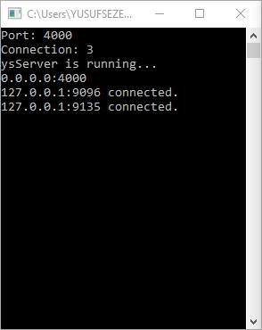
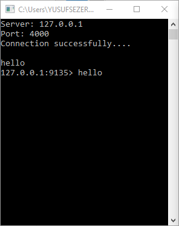
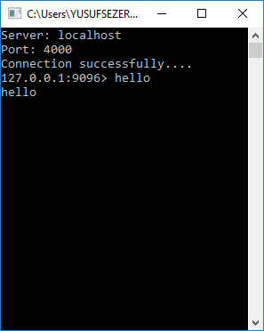
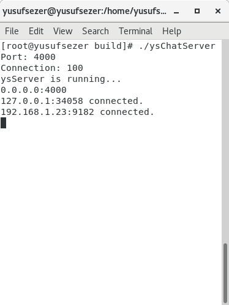
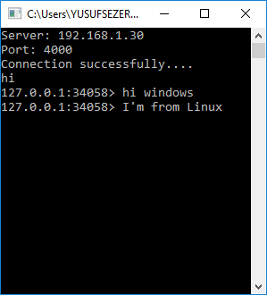
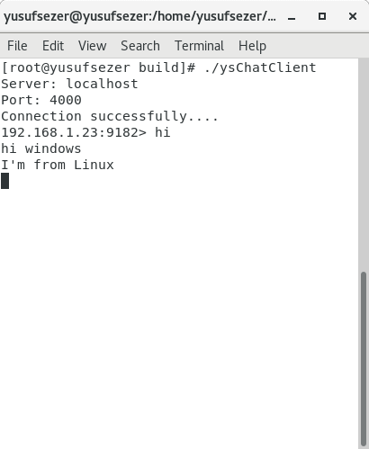

# C++ Cross Platform Multi Thread Chat Application

Project developed with Modern C++ for learn socket programming, parallel programming and multithreading subjects.

# 
Description will be add.

### Features
- Cross Platform
- Multi Thread
- Multi User Support
- Callback Support
- Configurable (Port, Connection size etc.)
- Modern C++

## [Download](https://github.com/yusufsefasezer/ysSocketChat/archive/master.zip)

## Screenshot
### Windows
#### Windows Server

#### Windows Client 1

#### Windows Client 2

### Cross Platform
#### Linux Server

#### Windows Client

#### Linux Client

# License
This project is licensed under the MIT License. See the [LICENSE](LICENSE) file for details

Created by [Yusuf Sezer](https://www.yusufsezer.com)
